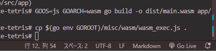

# square-face-tetris
物理エンジンをつけたテトリスのミノを人の顔にしたゲーム

# build
wasm としてビルドする。

```sh
GOOS=js GOARCH=wasm go build -o dist/main.wasm app/main.go
```

# run
`index.html` を直接開くか、Live Server を使用して HTTP サーバ－を起動する。
